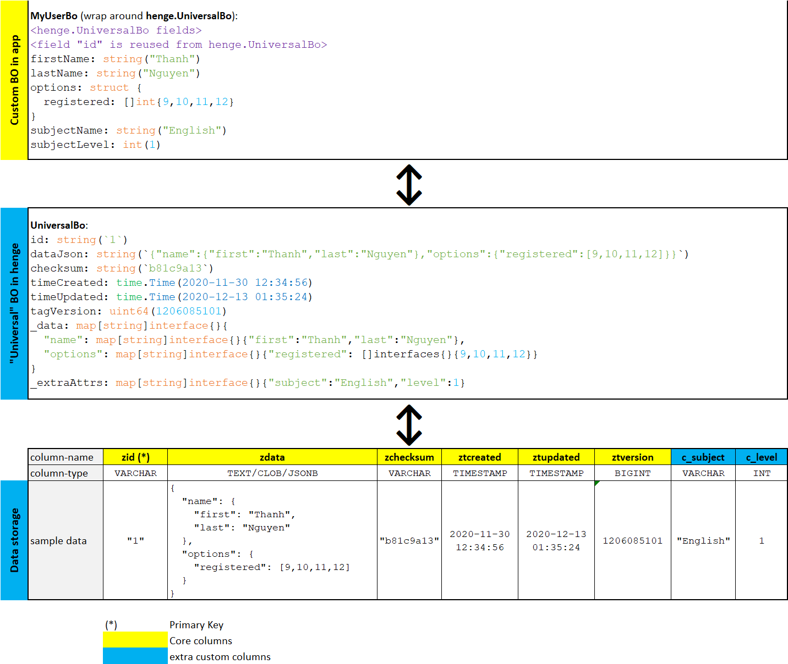

# henge

package henge is an out-of-the-box NoSQL style universal data access layer implementation.

Latest release [v0.2.0](RELEASE-NOTES.md).

## Documentation

`henge` aims to free application and developer from the headache of implementing low-level underlying data access layer (DAL) by
offering a universal DAL implementation.

At a glance, `henge` can fit into application's data access layers as illustrated in the following diagram:

**Data storage layer**

`henge` provides a ready-to-use data storage layer that supports (since [v0.2.0](RELEASE-NOTES.md)):
- AWS DynamoDB
- MongoDB
- MySQL
- MSSQL
- PostgreSQL
- Oracle
- SQLite (for non-production only, i.e. testing, poc, demo)

`henge` uses the following schema for data storage layer:
- Field/column `zid`: business object's unique id, implemented as primary key (for SQL storage) or partition key (for no-SQL storage).
  Its data type is VARCHAR or string (whichever is best fit with the underlying data store).
- Field/column `zdata`: store business object's member values. Its data type is TEXT, CLOB, JSONB or string (whichever is best fit with the underlying data store).
- Field/column `zchecksum`: checksum of business object data. Its data type is VARCHAR or string (whichever is best fit with the underlying data store).
- Field/column `ztcreated` and `ztupdated`: timestamp when business object is created/last updated. Its data type is DATETIME, TIMESTAMP or string (whichever is best fit with the underlying data store).
- Field/column `ztversion`: for application's internal use (can be used for compatibility check or data migration). Its data type is BIGINT, INT or number (whichever is best fit with the underlying data store).

`henge` also allow application to define its own fields/columns.

**"Universal" Business Object (BO) and Data Access Object (DAO) implementations**

`henge` also provides ready-to-use BO & DAO implementation to interact with the data storage layer.
- `UniversalBo`: no-SQL style universal business object. `UniversalBo` provide APIs to store/retrieve business attributes in hierarchy manner.
- `UniversalDao`: API interface to store/retrieve `UniversalBo` to/from data store. `henge` provides the following implementations:
  - `UniversalDaoDynamodb`: AWS DynamoDB-specific implementation, use [github.com/aws/aws-sdk-go](https://github.com/aws/aws-sdk-go) to access AWS DynamoDB.
  - `UniversalDaoMongo`: MongoDB-specific implementation, use [go.mongodb.org/mongo-driver/mongo](https://go.mongodb.org/mongo-driver/mongo) to access MongoDB server/cluster.
  - `UniversalDaoSql`: SQL-specific implementation. Since [v0.2.0](RELEASE-NOTES.md), `henge` supports the following database systems:
    - MSSQL: uses driver [github.com/denisenkom/go-mssqldb](https://github.com/denisenkom/go-mssqldb)
    - MySQL: uses driver [github.com/go-sql-driver/mysql](https://github.com/go-sql-driver/mysql)
    - Oracle: uses driver [github.com/godror/godror](https://github.com/godror/godror)
    - PostgreSQL: uses driver [github.com/jackc/pgx](https://github.com/jackc/pgx)
    - SQLite: uses driver [github.com/mattn/go-sqlite3](https://github.com/mattn/go-sqlite3)

**(Optional) Custom Business Object (BO) and Data Access Object (DAO) implementations**

Application can have its own BO and DAO implemenations. See source code of test scripts for examples.

## License

MIT - see [LICENSE.md](LICENSE.md).
